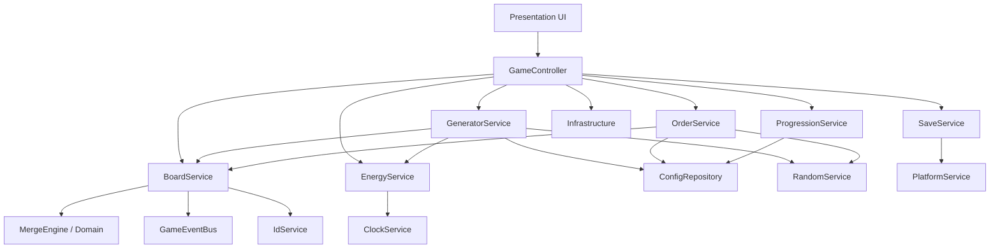

# 架构说明

## 分层



## 为什么 MergeEngine 是 pure TypeScript

- 可在 Node / Vitest 中独立测试，无需 Cocos Editor
- 未来若换渲染层（Web 预览、微信、原生）逻辑不重写
- 禁止 `import cc`、操作 Node/Sprite、读 localStorage

## 为什么 UI 不能直接修改 SaveData

- SaveData 是游戏权威状态
- UI 只调用 Gameplay Service，监听 `GameEventBus`
- 避免「表现层改数值导致存档损坏 / 不一致」

## 为什么 Config data-driven

- 合成链、生成器、订单、解锁、体力、经验都可调，不改代码
- Config Validator 启动时检查引用完整性
- 未来情侣内容（回忆 / 章节）可继续走配置

## 启动状态机

```text
BOOT → LOAD_CONFIG → VALIDATE_CONFIG → LOAD_SAVE
  → RECOVER_ENERGY → INIT_GAME → READY
```

失败时显示明确错误，不能停留在无意义的 Loading。

## 事件驱动 UI 刷新

逻辑先更新 → 发事件 → UI 播动画。  
禁止 Tween 结束后才执行 Merge。

至少事件：

- `ITEM_SPAWNED` / `ITEM_MOVED` / `ITEM_SWAPPED` / `ITEM_MERGED`
- `ENERGY_CHANGED`
- `ORDER_UPDATED` / `ORDER_COMPLETED`
- `XP_CHANGED` / `LEVEL_UP`
- `COINS_CHANGED` / `HEARTS_CHANGED`
- `GAME_SAVED`

## 平台隔离

`PlatformService` 封装 Editor / Web Preview / WeChat Mini Game。  
业务代码不得大量 `if (sys.platform === ...)`。
